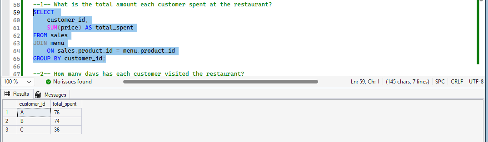
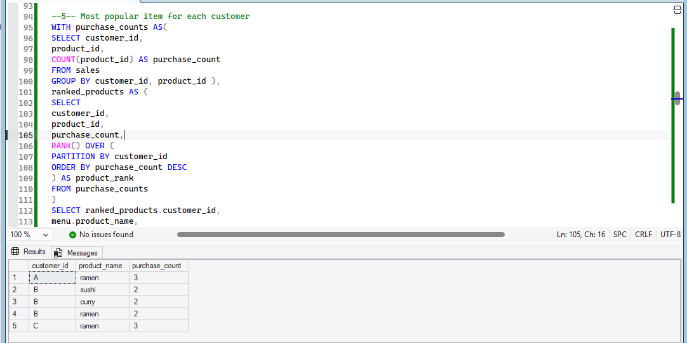
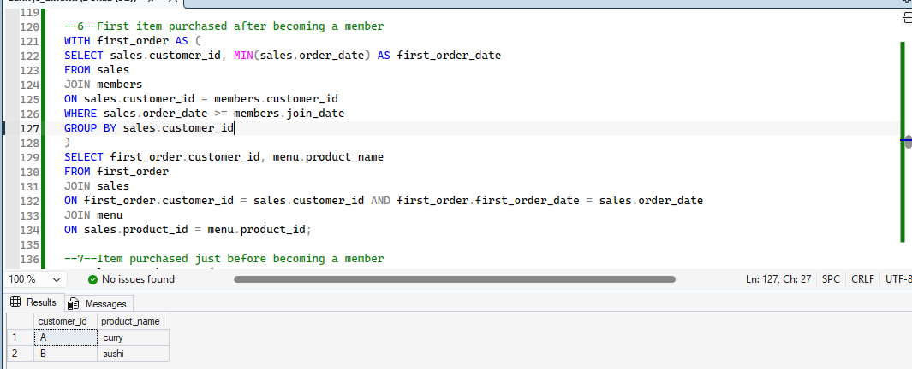
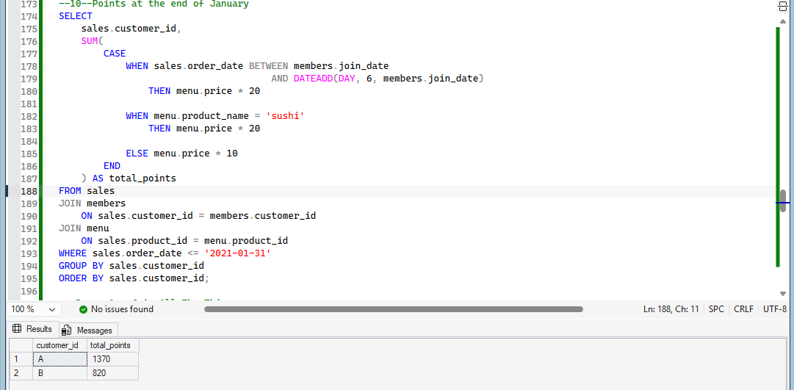
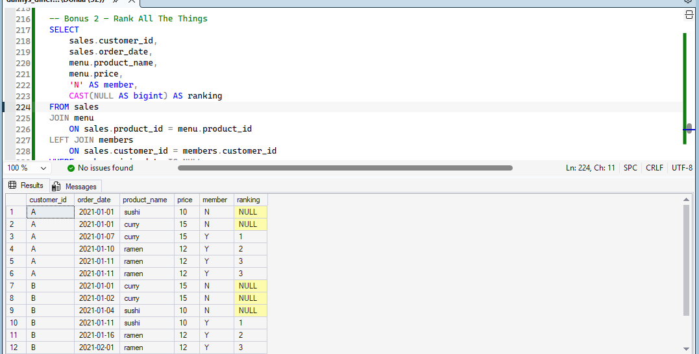

# 8 Week SQL Challenge - Case Study #1: Danny's Diner

## About
Analysis of a small restaurant's sales, menu and loyalty-program data
to understand customer visiting patterns, spending and favourite items.

## Dataset
Three tables: `sales`, `menu`, `members`.

## Tools
SQL Server (T-SQL), SSMS

## Skills Used
Joins, Aggregate functions, Subqueries, CTEs, Window functions (RANK), CASE WHEN, UNION ALL

## Questions Solved
1. Total amount each customer spent
2. Number of visit days per customer
3. First item purchased by each customer
4. Most purchased item overall
5. Most popular item for each customer
6. First item purchased after becoming a member
7. Item purchased just before becoming a member
8. Total items and amount spent before membership
9. Customer points
10. Points at the end of January

**Bonus:** Join All The Things, Rank All The Things

## Sample Results

### Q1 - Total spent per customer

### Q5 - Most popular item per customer

### Q6 - First item after becoming a member

### Q10 - Points at the end of January

### Bonus 2 - Rank All The Things

## Files
- `dannys_diner_solutions.sql` - database setup and all queries

## Credit
Case study by Danny Ma: https://8weeksqlchallenge.com/case-study-1/
